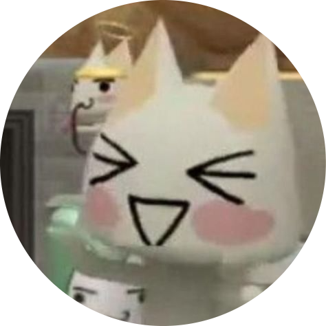
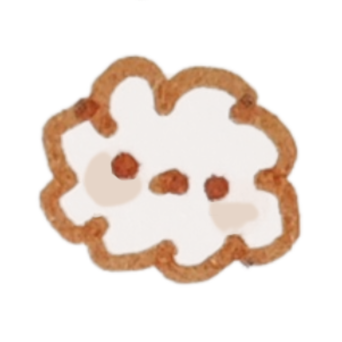

### Ki   
> do you like rust? i love it! 
>
> hehehehe i'm building 4-bit, 8-bit, and 16-bit computers all from scratch!! 

#### Projects 

#### Esolangs 

#### Archs 

PL icons by [Catppuccin](https://github.com/catppuccin/vscode-icons)
